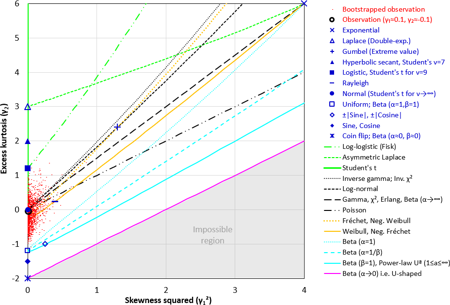
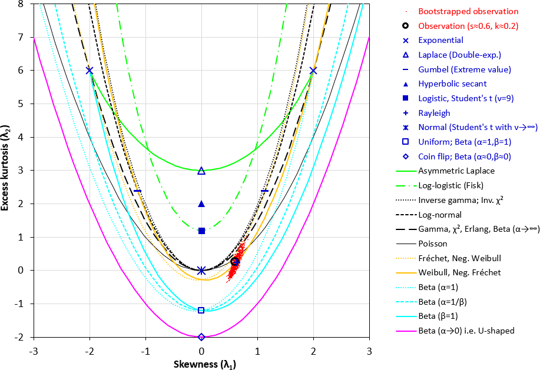
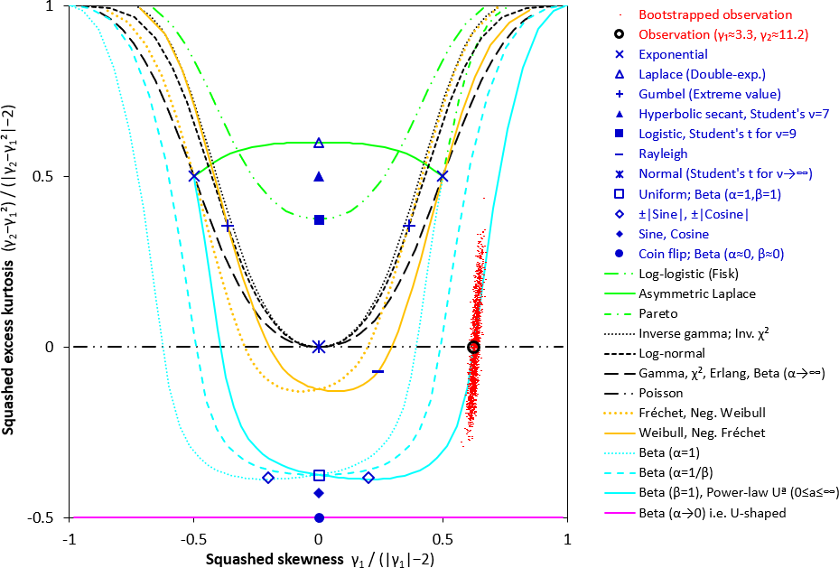

# PearsonPlot
A tool to investigate statistical distribution of univariate observations. It plots the [skewness](https://en.wikipedia.org/wiki/Skewness)-vs-[kurtosis](https://en.wikipedia.org/wiki/Kurtosis) of your data (together with bootsrapped samples) on a diagram for comparison with common [statsitical distributions](https://en.wikipedia.org/wiki/List_of_probability_distributions). Use it to investigate the possible statistical model describing your data. Three variants of the plot can be generated, depending on the range of skewness and kurtosis in your data.

The workbook is a further development of [Karl Pearson](https://en.wikipedia.org/wiki/Karl_Pearson)'s diagram (www.wikipedia.org/wiki/Pearson_distribution), which was revived by [Cullen & Frey](https://www.springer.com/gp/book/9780306459566). This workbook vastly improves upon the "Cullen and Frey plot" in [R](https://cran.r-project.org/web/packages/fitdistrplus/vignettes/paper2JSS.pdf) by comparing the observations with many more common distibutions, ones with either fixed skewness & kurtosis (i.e. shown as a point in the chart, e.g. Normal, Exponential) or varying skewness & kurtosis (i.e. shown as a line in the chart, e.g. Log-normal, Weibull).

## A note of caution
- Skewness and kurtosis statistics are very dependent on the sample size. Even hundreds of observations do not give a reliable estimate of the true population kurtosis and skewness. Therefore, the proximity of the observation skewness and kurtosis (the black circle on the diagrams below) to one of the standard distributions in the diagrams, is only indicative, and might be coincidental. This issue is remediated by the [bootstrapped](https://en.wikipedia.org/wiki/Bootstrapping_(statistics)) samples (the red dots in the diagrams), which show the possible area of the true population kurtosis and skewness. The 1500 bootstrapped-sample dots indicate roughly the 99.9% confidence bounds of the polulation distribution.
- Many statistical distibutions with [heavy tails](https://en.wikipedia.org/wiki/Heavy-tailed_distribution) (e.g. Cauchy, Lévy, Student's t with v<2 degrees of freedom) have undefined skewness or kurtosis, irrespective of the number of observations. This means that individual random extreme values can throw the skewness or kurtosis of the whole data set. Such "undefined" skewness or kurtosis can be seen as a vertical or horizontal spread of bootstrapped observations in Chart 3.
- When you are aware of these limitations, these diagrams are very useful. It has for example helped me discover that thermal conductivity of mineral-wool insulation (which I initially assumed to be log-normal) is actually log-logistic, as it is a mixture of two components (air and fibres), not a homogeneous material.

## User-instructions
This workbook contains a Visual Basic for Applications (VBA) macro to analyze the statistical distribution of your data, and to generate plots, so you have to activate the macros first time you open the workbook.
- <b>STEP 1</b>: Paste your observations into column A of sheet "InputData". There is no limit to the number of values.
- <b>STEP 2</b>: The data is analyzed automatically and plotted when you click on the tab for one of the plots (Chart1, Chart2 or Chart3). The sample skewness and kurtosis of your data is plotted as a black circle, and [bootstrapped](https://en.wikipedia.org/wiki/Bootstrapping_(statistics)) values are plotted with small red dots, to show the range of possible values of the polulation skewness and kurtosis.

## Output options

 
<b>Chart 1</b>: Distributions with positive skew in the range 0 to +2 (plotted squared), and excess kurtosis up to +6. (The example observations plotted on this chart are normally-distributed).

 

 
<b>Chart 2</b>: Distributions with skewness in the range +3 to +3, and excess kurtosis up to +8. (The example observations plotted on this chart are from a negative-expoential distribution)

 

 
<b>Chart 3</b>: Distributions with any value of skewness and kurtosis. Both parameters are squashed into the range -1 to +1. Skewness squared is subtracted from kurtosis before squashing, thus reducing the "impossible region" to a small rectangle, and making  distributions with kurtosis &Proportional; skewness² into horizontal lines. (The example observations plotted on this chart are from a power-law distribution, which rarely occurs in the physical world)

## Licence
GPL3

## Author and copyright
peter.schild@oslomet.no 
