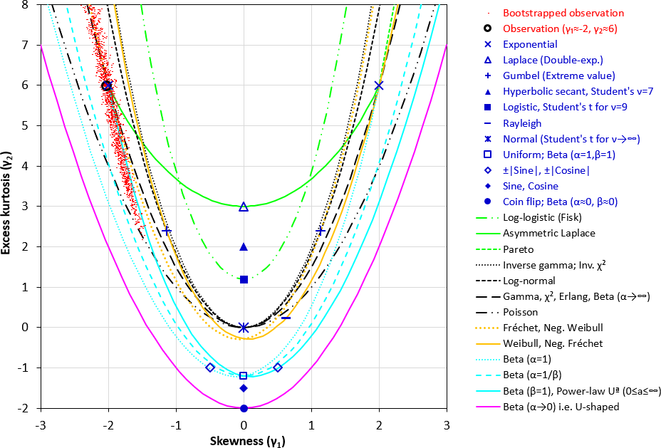

# PearsonPlot (Moment-Ratio Diagram)
A tool to investigate statistical distribution of univariate observations. It plots the [skewness](https://en.wikipedia.org/wiki/Skewness)-vs-[kurtosis](https://en.wikipedia.org/wiki/Kurtosis) of your data (together with bootsrapped samples) on a diagram for comparison with common [statsitical distributions](https://en.wikipedia.org/wiki/List_of_probability_distributions). Use it to find the statistical distribution that best describes your data. Three variants of the plot can be generated, depending on the range of skewness and kurtosis in your data.

The workbook is a further development of [Karl Pearson](https://en.wikipedia.org/wiki/Karl_Pearson)'s diagram (www.wikipedia.org/wiki/Pearson_distribution), which was revived by [Cullen & Frey](https://www.springer.com/gp/book/9780306459566). This workbook vastly improves upon the "Cullen and Frey plot" in [R](https://cran.r-project.org/web/packages/fitdistrplus/vignettes/paper2JSS.pdf) by comparing the observations with many more common distibutions, ones with either fixed skewness & kurtosis (i.e. shown as a point in the chart, e.g. Normal, Exponential) or varying skewness & kurtosis (i.e. shown as a line in the chart, e.g. Log-normal, Weibull).

Statistical sistributions that are plotted: 
- *Distributions with fixed skewnes & kurtosis*: [Exponential](https://en.wikipedia.org/wiki/Exponential_distribution), [Laplace (double-exponential)](https://en.wikipedia.org/wiki/Laplace_distribution), [Gumbel](https://en.wikipedia.org/wiki/Gumbel_distribution) (Extreme value), [Hyperbolic secant](https://en.wikipedia.org/wiki/Hyperbolic_secant_distribution), [Logistic](https://en.wikipedia.org/wiki/Logistic_distribution), [Rayleigh](https://en.wikipedia.org/wiki/Rayleigh_distribution), [Normal](https://en.wikipedia.org/wiki/Normal_distribution), [Uniform](https://en.wikipedia.org/wiki/Continuous_uniform_distribution), Sine & Cosine, |Sine| & |Cosine|, [Coin-flip](https://en.wikipedia.org/wiki/Beta_distribution).
- *Distributions with variable skewnes & kurtosis*: [Log-logistic](https://en.wikipedia.org/wiki/Log-logistic_distribution) (Fisk), [Asymmetric Laplace](https://en.wikipedia.org/wiki/Asymmetric_Laplace_distribution), [Inverse gamma](https://en.wikipedia.org/wiki/Inverse-gamma_distribution), [Invere Χ²](https://en.wikipedia.org/wiki/Inverse-chi-squared_distribution), [Log-normal](https://en.wikipedia.org/wiki/Log-normal_distribution), [Gamma](https://en.wikipedia.org/wiki/Gamma_distribution), [Χ²](https://en.wikipedia.org/wiki/Chi-squared_distribution) (Chi-squared), [Erlang](https://en.wikipedia.org/wiki/Erlang_distribution), [Student's t](https://en.wikipedia.org/wiki/Student%27s_t-distribution), [Beta](https://en.wikipedia.org/wiki/Beta_distribution), [Poisson](https://en.wikipedia.org/wiki/Poisson_distribution), [Fréchet](https://en.wikipedia.org/wiki/Fr%C3%A9chet_distribution), Negative Weibull, [Weibull](https://en.wikipedia.org/wiki/Weibull_distribution), Negative Fréchet, [Power-law](https://en.wikipedia.org/wiki/Power_law), [Pareto](https://en.wikipedia.org/wiki/Pareto_distribution).

## A note of caution
- Skewness and kurtosis statistics are very dependent on the sample size. Even hundreds of observations do not give a reliable estimate of the true population kurtosis and skewness. Therefore, the proximity of the observation skewness and kurtosis (the black circle on the diagrams below) to one of the standard distributions in the diagrams, is only indicative, and might be coincidental. This issue is remediated by the [bootstrapped](https://en.wikipedia.org/wiki/Bootstrapping_(statistics)) samples (the red dots in the diagrams), which show the possible area of the true population kurtosis and skewness. The 1500 bootstrapped-sample dots indicate roughly the 99.9% confidence bounds of the polulation distribution.
- Many statistical distibutions with [heavy tails](https://en.wikipedia.org/wiki/Heavy-tailed_distribution) (e.g. Cauchy, Lévy, Student's t with v<2 degrees of freedom) have undefined skewness or kurtosis, irrespective of the number of observations. This means that individual random extreme values can throw the skewness or kurtosis of the whole data set. Such "undefined" skewness or kurtosis can be seen as a vertical or horizontal spread of bootstrapped observations along the border in Chart 3.
- When you are aware of these limitations, these diagrams are very useful. It has for example helped me discover that thermal conductivity of mineral-wool insulation (which I initially assumed to be log-normal) is actually log-logistic, as it is a mixture of two components (air and fibres), not a homogeneous material.

## User-instructions
This workbook contains a Visual Basic for Applications (VBA) macro to analyze the statistical distribution of your data, and to generate plots, so you have to activate the macros first time you open the workbook.
- <b>STEP 1</b>: Paste your observations into column A of sheet "InputData". There is no limit to the number of values.
- <b>STEP 2</b>: The data is analyzed automatically and plotted when you click on the tab for one of the plots (Chart1, Chart2 or Chart3). The sample skewness and kurtosis of your data is plotted as a black circle, and [bootstrapped](https://en.wikipedia.org/wiki/Bootstrapping_(statistics)) values are plotted with small red dots, to show the range of possible values of the polulation skewness and kurtosis.

## Output options

 
<b>Chart 1</b>: Distributions with positive skew in the range 0 to +2 (plotted squared), and excess kurtosis up to +6. (The example observations plotted on this chart are normally-distributed).

 

 
<b>Chart 2</b>: Distributions with skewness in the range +3 to +3, and excess kurtosis up to +8. (The example observations plotted on this chart are from a negative-exponential distribution)

 

 
<b>Chart 3</b>: This chart can show all valid values of skewness (±&infin;) and excess kurtosis (-3 to +&infin;). Both parameters are squashed into the range ±1. Skewness-squared is subtracted from kurtosis before squashing, making distributions with kurtosis &Proportional; skewness² into horizontal lines (e.g. Poisson, Beta with &alpha;&rarr;0), and the "impossible region" becomes bounded below a horizontal line (squashed excess kurtosis -0.5), and so can be omitted from the chart. (The example observations plotted on this chart are from a power-law distribution, which rarely occurs in the physical world, and coincidentally have the same kurtosis as the discrete Poisson distrubution)

## How to confirm the best candidate distribution (numerical workflow)
*PeasonPlot* is a great exploratory tool to subjectively select the best distribution, or at worst to find a shortlist of candidate distributions. But for scientific publishing, additional steps are recommended to numerically compare the confirm the best distribution. R seems to be best suited to this task; with Python second up. Below is a step-by-step guide:

1. **Shortlist candidates (exploratory)**: Use *PearsonPlot* (moment-ratio diagram) to shortlist a small set of (say 3 to 8) plausible distribution families.
2. **Fit each candidate distribution to the data**: Prefer [maximum likelihood estimation](https://en.wikipedia.org/wiki/Maximum_likelihood_estimation) (MLE):
   * *R*: `fitdistrplus::fitdist(x, "<dist>", method="mle")`, where `<dist>` is candidate distributions, e.g. `lnorm`, `gamma`, `weibull`
   * *Python*: `scipy.stats.<dist>.fit(x)` 
3. **Compare candidates by objective criteria**: Compute [log-likelihood](https://en.wikipedia.org/wiki/Likelihood_function#Log-likelihood), [Akaike information criterion](https://en.wikipedia.org/wiki/Akaike_information_criterion) (AIC), [Bayesian information criterion](https://en.wikipedia.org/wiki/Bayesian_information_criterion) (BIC) and rank your candidate distributions (lower AIC/BIC is more parsimonious, i.e. a good compromise between complexity and accuracy):
   * *R*: `gofstat(list_of_fits)` returns AIC/BIC and [Goodness-of-fit](https://en.wikipedia.org/wiki/Goodness_of_fit) (GOF) stats for multiple fits.
   * *Python*: compute AIC/BIC from `sum(dist.logpdf(x, *params))`.
4. **Visually inspect diagnostic plots**: Prioritise [Q–Q](https://en.wikipedia.org/wiki/Q%E2%80%93Q_plot) / [P–P](https://en.wikipedia.org/wiki/P%E2%80%93P_plot) plots and [Empirical/Cumulative Distribution Function](https://en.wikipedia.org/wiki/Empirical_distribution_function) (CDF) overlays (often visually more informative for quality-control than a single p-value):
   * *R*: `denscomp`, `cdfcomp`, `qqcomp`, `ppcomp` compare multiple fitted distributions directly.
   * *Python*: build plots from `dist.cdf`, `dist.ppf`, and sorted data.
5. **Goodness-of-fit (GOF) tests and/or bootstrap confirmation**: Use a GOF statistic (e.g. Anderson–Darling, Cramér–von Mises, KS) and consider parametric [bootstrap](https://en.wikipedia.org/wiki/Bootstrapping_(statistics)) for a publication-grade check (especially tail fit):
   * *Python*: `scipy.stats.goodness_of_fit` provides fit-aware GOF statistics.
6. **Report your selection principle**: State how the shortlist was produced (*PearsonPlot*), then how the final model was chosen (e.g. lowest BIC + best Q–Q tail behaviour + bootstrap uncertainty).

## How to deal with grouped data (numerical workflow)
It is very common that real-world data is grouped, e.g. different measurement point locations (different groups), with repeated observations at each point (within each group). The data are [Independent and Identically Distributed](https://en.wikipedia.org/wiki/Independent_and_identically_distributed_random_variables) (IID) only within each group of observations, but you want to find the distribution that best fits all groups (but with different fit-parameters for each group). You can test distribution families objectively as followed, by modelling the grouping rather than pretending that the pooled data are all IID:
* *R*: For a given distribution, fit each group separately, then sum log-likelihoods across groups, then compute global AIC/BIC per distribution-family (penalizing for number of parameters across all groups). `fitdistrplus` doesn’t automatically “sum across groups” for you, but it gives you the per-fit Log-Likelihood (logLik)/parameter counts you need.
* *Python*: Just as for *R*, fit each group separately for a given distribution; loop over groups, `sum dist.logpdf(...)`, compute AIC/BIC on the combined logLik.

## Further reading about moment-ratio diagrams
- SAS blog on Moment-Ratio diagrams [https://blogs.sas.com/content/iml/2020/01/15/moment-ratio-diagram.html]
- Vargo, E., Pasupathy, R., Leemis, L.M. (2017). Moment-Ratio Diagrams for Univariate Distributions. In: Glen, A., Leemis, L. (eds) Computational Probability Applications. International Series in Operations Research & Management Science, vol 247. Springer, Cham. [https://doi.org/10.1007/978-3-319-43317-2_12]

## Licence
GPL3

## Author and copyright
peter.schild@oslomet.no 
